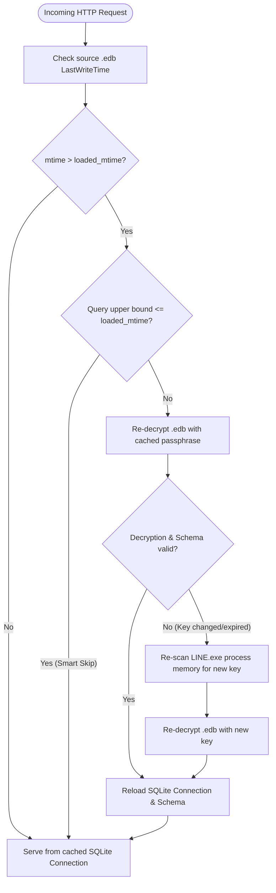

# line-tool

Rust CLI/REST-API replacement for `find_passphrase.py` + `extract_messages.py`.
Finds the LINE encryption passphrase directly from a **live** `LINE.exe`
process's memory (no memory dump file required), decrypts the encrypted
SQLite (`.edb`), and lets you query messages by chat/sender/date.

>**Legal Notice:** Use only on data you own or have explicit permission to
>analyze. Intended for forensic/research purposes.

## Why it needs `LINE.exe` running

The passphrase is never written to disk in plaintext — it only exists in the
process's memory while it's logged in. It's not randomly regenerated per
session either: it has to stay stable per account/device, since old message
pages were AES-encrypted with a key derived from this same passphrase and
still need to decrypt after a restart. So `find-key`/`extract`/`serve` need
`LINE.exe` (or an equivalent memory dump) at hand to read it — there's no
persistent-file fallback.

## Build

```bash
cargo build --release
```

Produces `target/release/line-tool.exe`, statically-linked-ish, ~2.4MB.

## CLI usage

```bash
# Find the passphrase from a running LINE.exe (default process name)
line-tool find-key --process-name LINE.exe

# One-shot decrypt + query (like extract_messages.py) — group chat by name
line-tool extract --edb "C:\...\qw....edb" --process-name LINE.exe \
  --group "some group name" --sender "some contact name" --limit 3

# Or a 1:1 DM by contact name (--group and --contact are mutually exclusive)
line-tool extract --edb "C:\...\qw....edb" --process-name LINE.exe \
  --contact "some contact name" --limit 3

# Or pin by exact mid to avoid name-collision ambiguity entirely
line-tool extract --edb "C:\...\qw....edb" --process-name LINE.exe \
  --chat-id cXXXXXXXXXXXXXXXXXXXXXXXXXXXXXXXX \
  --sender-id uXXXXXXXXXXXXXXXXXXXXXXXXXXXXXXXX \
  --date 2026-08-18

# Discover mids for a name before pinning them (prints group and contact matches separately)
line-tool extract --edb "C:\...\qw....edb" --process-name LINE.exe --lookup "some name"

# Skip live scanning if you already have the passphrase
line-tool extract --edb "C:\...\qw....edb" --passphrase <your32charhexpassphrase> --chat-id ...
```

Date/time filters (`--date`, `--start`, `--end`) are interpreted as **local**
calendar days. With none given, defaults to today (local).

## REST API

```bash
line-tool serve
```

With no flags at all, `serve`:
- auto-discovers the `.edb`: the **largest** `.edb` file directly under
  `%LOCALAPPDATA%\LINE\Data\db` (non-recursive) — LINE's main chat database
  dwarfs its siblings (`album_qw....edb`, `chatStats_qw....edb`,
  `keep_qw....edb`, and the `AutoSuggest` subfolder) by 2-3 orders of
  magnitude, so size alone is a reliable pick without depending on a naming
  convention that could change. Override with `--edb <path>`.
- auto-discovers `LINE.exe` by process name (same as `find-key`/`extract`).
  Override with `--process-name`/`--pid`, or skip live scanning entirely
  with `--passphrase <known key>`.
- listens on **both** `127.0.0.1:5463` and `[::1]:5463` (IPv4 + IPv6
  loopback). If IPv6 isn't available on this host, that bind is skipped with
  a warning rather than failing the whole server — it only errors out if
  *neither* comes up. Override the port with `--port`, or take full control
  with `--addr <host:port>` (binds exactly that one address instead).
- serves an interactive **Scalar API Reference UI** at `http://127.0.0.1:5463/docs` (or `/`)
  and the dynamic **OpenAPI 3.1 specification** at `http://127.0.0.1:5463/openapi.json`.

### Static OpenAPI Specification Export

You can also inspect the schema and dump the full OpenAPI 3.1 JSON without running the HTTP server:

```bash
line-tool openapi > openapi.json
```

Decrypts the `.edb` at startup (into a fixed temp file, reused/overwritten
on each `serve` run), introspects its schema, and serves **one generic route**
that reflects every table in the decrypted database — no per-table handlers to
maintain, no risk of one endpoint's logic drifting from another's:

### Automatic Hot-Reload & Smart Query Skip

`serve` stays live and automatically synchronizes with new incoming messages:

- **Filesystem `LastWriteTime` Check**: On incoming HTTP requests, the server checks the source `.edb`'s modification timestamp (`mtime`) using lightweight OS metadata inspection (~microseconds).
- **Smart Query Skip**: If the request includes an upper-bound filter on a time column (`createdTime<=...`, `createdTime<...`, `createdTime$date=...`, etc.) where the target timestamp is older than or equal to the loaded snapshot's `mtime`, re-decryption is **skipped**. The cached snapshot already contains all possible matching rows.
- **Auto Re-decryption**: If `edb.mtime > loaded_mtime` (and not skipped), the database is automatically re-decrypted into the local temp database and the SQLite connection refreshed.
- **Key Recovery Fallback**: If decryption or schema verification fails (e.g. LINE restarted with a new session key), the server automatically re-scans `LINE.exe`'s process memory for the new passphrase and retries.




### `GET /{table}?{column}{op}{value}...`

- `{table}` is any real table name **minus its leading `_`** — e.g. `_message`
  → `/message`, `_groupChat` → `/groupChat`, `_room` → `/room`. The server
  logs the full list of tables it found at startup.
- `{column}` is likewise the real column name minus its leading `_` (e.g.
  `_chatId` → `chatId`).
- `{op}` is written **literally** in the query string (not URL-encoded,
  though encoded also works — both are decoded before the operator is
  parsed: `createdTime>=1755000000000`):
  - `=`, `>`, `<`, `>=`, `<=`, `!=` — standard comparisons.
  - `>!=`, `<!=` — OpenAPI/Scalar UI friendly aliases for strictly greater than (`>`) and strictly less than (`<`).
  - `^=`, `*=`, `$=` — CSS-attribute-selector-style string matches:
    starts-with, contains, ends-with. Each becomes `LIKE` with the `%`
    wildcard placed for you (`chatName*=Example` → `LIKE '%Example%'`) — you
    never write `%` yourself for these.
  - Boolean flag shorthand: `?isArchived` expands to `isArchived=1` (true); `?!isArchived` expands to `isArchived=0` (false). `?isArchived=true`/`false` is also parsed directly.
  - `$date` as a column **suffix**, combined with any comparison op, treats
    the value as an ISO `YYYY-MM-DD` **local** calendar day instead of a raw
    number: `createdTime$date=2026-08-18` expands to a whole-day range;
    `createdTime$date>=2026-08-18` anchors on that day's start,
    `createdTime$date>2026-08-18` on the *next* day's start (excludes the
    whole day), and symmetrically `<=`/`<` anchor on/before that day's end.
- Reserved control params, never treated as filters — marked with a leading
  `$` so they can never collide with a real column (no real column here
  starts with `$`, only `_`):
  - `$sort=-createdTime,otherCol` — comma-separated columns, each optionally
    prefixed `-` for descending (ascending otherwise). Multi-column sort is
    supported.
  - `$limit=20` — max rows. Defaults to **20** when omitted (otherwise an
    unbounded query would dump the whole table — `_message` alone has
    ~400k rows). Rejected with **400** if given as `>100` or `<1` — not
    silently clamped, since this is queried by hand most of the time and a
    silently short page is more likely to mislead than a clear error.
  - `$cursor=...` — keyset pagination cursor, paired with `$sort` (see below).

Every table/column name is validated at request time against a whitelist
built once at startup from `sqlite_master`/`PRAGMA table_info` — only those
real, already-existing identifiers are ever interpolated into the SQL text.
All filter/cursor *values* stay bound as parameters (never string-concatenated),
so this is injection-safe despite building SQL dynamically from the URL.

```
GET /groupChat?chatName*=Example
{"rows":[{"chatMid":"cXXX...","chatName":"Example Group","createdTime":1700000000000,...}],"next_cursor":null}

GET /message?chatId=cXXXXXXXXXXXXXXXXXXXXXXXXXXXXXXXX&createdTime$date=2026-08-18&$sort=-createdTime&$limit=2
{"rows":[{"from":"uXXX...","createdTime":1700000100000,"text":"...","...":"...(every _message column)"}],"next_cursor":"1700000100000"}
```

Column values come back as their raw SQLite storage type — `createdTime` is
the raw epoch-ms integer, not an RFC3339 string (`$date` only affects how a
*filter value* is parsed, not how output is formatted); `_message`'s many
JSON-blob text columns (`reactionStatus`, `contentMetadata`, etc.) come back
as raw JSON-encoded strings, not parsed. There's no `_chat`⋈`_groupChat`/
`_contact` join — this is a direct table reflection, not a curated view.
Composing a lookup then a query takes two calls, e.g. `/groupChat?chatName*=...`
for the id, then `/message?chatId=<that id>&...`.

#### Pagination

Uses **keyset (cursor) pagination** via `$sort`, not `OFFSET`/`skip`. When
every `$sort` column is indexed together in the order given (e.g. `_message`'s
`createdTime` alone, the leading column of a composite index — see below), a
cursor stays an index seek at any depth; `OFFSET n` would be an O(n) scan per
page and can skip or duplicate rows if new rows land between calls (this
dataset keeps growing).

`$sort` supports multiple columns (`$sort=-createdTime,id`), and pagination is
a proper multi-column keyset — the next page starts strictly after the full
sort-key *tuple* from the last row, not just its first column. The response's
`next_cursor` is that tuple, comma-joined in `$sort`'s column order; pass it
straight back as `$cursor` for the next page in the same directions.
`next_cursor` is `null` whenever `$sort` isn't set, or once a page comes back
short of `$limit` (no more results). Note: a sort-key value containing a
literal comma won't round-trip correctly through this comma-joined cursor —
not a concern for LINE's ids/timestamps, but worth knowing before sorting by
free-text columns.

```
GET /message?chatId=cXXX...&$sort=-createdTime&$limit=20               -> rows[0..19], next_cursor="T"
GET /message?chatId=cXXX...&$sort=-createdTime&$limit=20&$cursor=T     -> rows[20..39], next_cursor="T2"
```

Errors return `{"error": "..."}`: 404 for an unknown table, 400 for an
unknown column/sort-column/operator, a malformed `$cursor`, or an
out-of-range/non-integer `$limit`, 500 for anything else (e.g. a malformed
SQLite-level failure).

#### A note on `curl` and shell quoting

`>`, `<`, and `&` are shell metacharacters — always wrap the whole URL in
**single** quotes when testing with `curl`, e.g.
`curl 'http://...&createdTime>=123&$sort=-createdTime'`, or the shell will
try to redirect/background instead of passing the characters through.
Double quotes are not enough here: `$sort`/`$limit`/`$cursor` start with `$`,
which bash still expands as a variable reference *inside* double quotes
(typically to an empty string, silently dropping the param) — only single
quotes suppress that. Either way, once it reaches the server it's a literal
character in the request line, which the operator-scanner recognizes
directly (no percent-encoding needed, though it's also accepted).

## Indexes actually present (as found in the decrypted `.db`)

These already exist in LINE's own schema — nothing this tool creates. They
matter because `$sort`/`$cursor` pagination is only an index seek when every
sort column is covered together, in order, by one index; anything else falls
back to a full scan (fine for occasional/local use, just not free):

```sql
-- _message: the main hot path - chat + time range + ORDER BY createdTime
CREATE INDEX _message__chatId__createdTime__contentType__status__hasUrlPreview__rev
  ON _message (_chatId, _createdTime, _contentType, _status, _hasUrlPreview, _rev);

CREATE INDEX _message__reqSeqV2 ON _message (_reqSeqV2);
CREATE INDEX _message__status   ON _message (_status) WHERE _status >= 3;
CREATE INDEX _message__flag__chatId ON _message (_flag, _chatId) WHERE _flag >= 1;
-- plus an implicit unique index on _message's primary key (_id)

CREATE INDEX _chat__id__midType__status__firstUnreadId
  ON _chat (_id, _midType, _status, _firstUnreadId);
-- plus implicit unique indexes on _chat._id, _contact._mid, _groupChat._chatMid
```

Name/text columns like `_groupChat._chatName` and `_contact._displayName`
have **no index at all**, so `chatName_like=`/`displayName_like=` is always a
full scan — expected for a leading-wildcard substring search regardless (an
index couldn't help `LIKE '%...%'` even if one existed).

Verify any query plan yourself against the decrypted `.db`:

```sql
EXPLAIN QUERY PLAN
SELECT * FROM _message WHERE _chatId = ? AND _createdTime >= ? ORDER BY _createdTime DESC;
-- SEARCH _message USING INDEX _message__chatId__createdTime__... (_chatId=? AND _createdTime>?)
```

## Modules

- `discover.rs` — finds the `.edb` automatically for `serve` (largest one
  under `%LOCALAPPDATA%\LINE\Data\db`, non-recursive) when `--edb` is omitted.
- `procmem.rs` — enumerates a process by name (`CreateToolhelp32Snapshot`) and
  walks its committed memory regions (`VirtualQueryEx` + `ReadProcessMemory`).
- `findkey.rs` — scans a byte buffer for `encryptionKey":"<32hex>mse` in both
  ASCII and UTF-16LE forms (port of `find_passphrase.py`).
- `crypto.rs` — port of `decrypt-LINE.py`'s page-cipher scheme (MD5/RC4 key
  derivation, per-page AES-128-CBC, page-1 header restoration).
- `extract.rs` — chat/sender name resolution and the `_message` query used by
  the CLI `extract` command (date parsing, group/contact disambiguation).
- `schema.rs` — introspects `sqlite_master`/`PRAGMA table_info` once at server
  startup into the table/column whitelist the generic route validates against.
- `generic.rs` — parses filters into SQL (`WHERE`/`ORDER BY`/`LIMIT`), binding
  every value as a parameter and every identifier from the `schema.rs` whitelist.
- `openapi.rs` — dynamically generates OpenAPI 3.1 specifications from introspected SQLite schema and embeds the Scalar API Reference UI.
- `server.rs` — the HTTP loop(s) (one thread per bound address, sharing one
  decrypted connection/schema), query-string parsing (including the literal
  `>=`/`<=`/`!=` operator scanner), and `Link` header construction, built on
  `tiny_http` (no async runtime).
